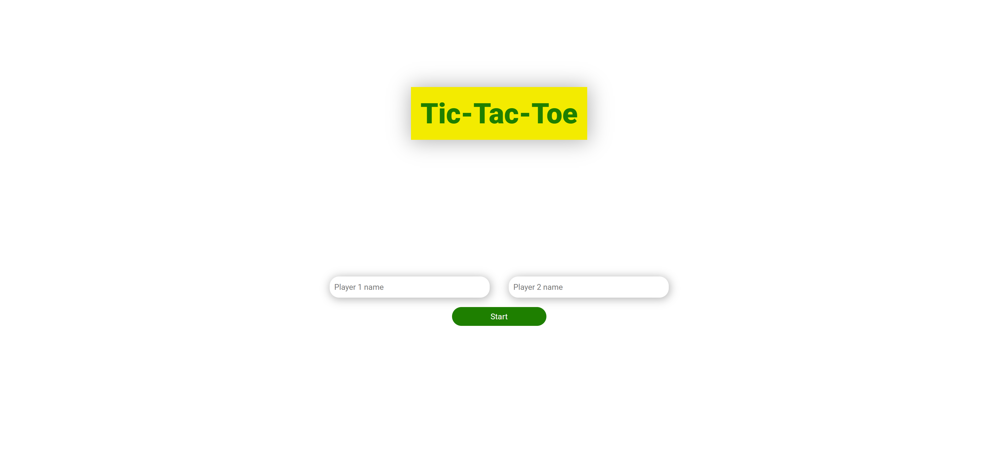
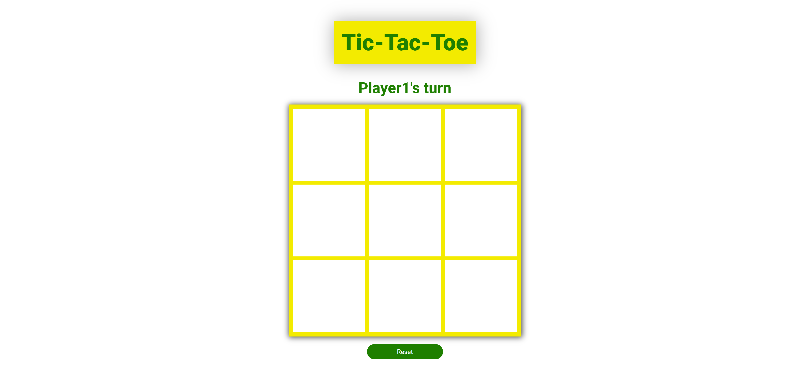

# Tic-Tac-Toe
Tic-tac-toe focuses on using factory functions and immediately invoked function expressions (IIFE) to create a two-player user interactive game. 

### <a href="">LIVE VERSION</a>
### Initial Page
 
### Board Page 
 